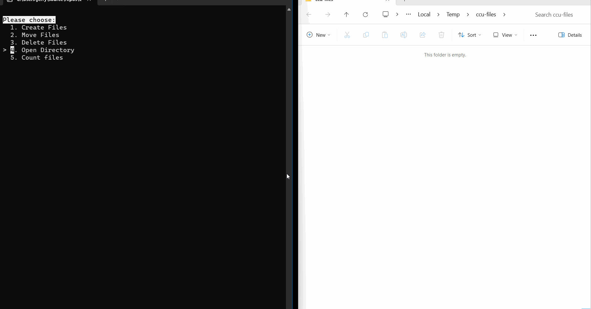

# CIS-230-SP24

You are part of a development team. The rest of the team has build a menu-driven UI with several helper methods and are turning to you to implement the three methods to make the application work. It is not reuqired that you change any code except that code in the `assignment.cs` file. 



Imagine, for example, if you had a folder of photos and you wanted to move them all to a folder structure by date. Like this assignment, you would get each file, read the date, then move them around. Manipulating the file system is a super-power. 

### Assignment Explanation

In this assignment, write a class that manipulates files within a temporary directory. The objective is to familiarize students with file I/O operations, directory management, and basic string manipulation in C#. The class should have three primary methods:

1. `CreateFiles()`: Generates files with content that includes a timestamp in their names.
2. `MoveFiles()`: Organizes these files into a structured directory format: year/month.
3. `DeleteFiles()`: Cleans up by deleting all created files and directories.

> If you want to create any other methods, properties, or fields, that is fine & up to you. 

### Learning Objectives

1. **File System** 

No doubt, a big part of this assignment is working with `directory` and `file` objects on your file system. Working on a PC or a Mac, this experience is identical because the .NET runtime hides the ugly details from you and translates C# into the operating system-specific code necessary to create directories, create files, and move them. 

2. **Class structure**

This assignment requires that you implement the `Assignment` class. There are a lot of features to a C# class, but you are only required to implement the three empty methods provided for you. The constructor (the method that runs when a class is created) has been created for you with a `rootDirectory` parameter that is stored in the `_rootDirectory` field for you. 

3. **Clean code**

There are secveral rules you need to remember while creating your methods. The first is to reduce your methods to as few lines as possible. Ten lines is the guideline for the maximum number of lines in a method, though that is flexible to you as the author. However, if you find your methods getting too large, consider a `local method` or a separate `private method` that breaks apart large operations into logical pieces. 

4. **Overall experience**

It is the goal of this assignment to provide to the user a streamlined and simple experience. You may need to update the menu to make the experience better. Fact is, you can do anything to this application. 

### Acceptance Criteria

1. **CreateFiles()**
   - Exactly _N_ files using `Helper.WriteImageFile()`. 
   - Each file is named using `Helper.GetRandomFilename()`. 
   - All files are located in the specified base directory.

2. **MoveFiles()**

   - The files are moved to the correct directory. 
   - There are no files remaining in the base directory.
   - There are no empty directories uder the base directory.
   - The directory structure accurately reflects timestamps in file names.

> Example folder structure: `{baseDirectory}\2024\02\2024-02-20.1ABCD.png`.<br/>
> Example folder structure: `{baseDirectory}\2023\03\2023-03-20.1ABCD.png`.

3. **DeleteFiles()**
   - All files created during the assignment are removed.
   - All directories created during the assignment are removed, including the root temporary directory.
   - The system returns to its initial state with no residual files or directories.

### Class Documentation

```csharp
public class Assignment
{
    private string _rootDirectory;

    public Assignment(string rootDirectory)
    {
        _rootDirectory = rootDirectory;
    }

    public void CreateFiles()
    {
        // Implementation goes here.
    }

    public void MoveFiles()
    {
        // Implementation goes here.
    }

    public void DeleteFiles()
    {
        // Implementation goes here.
    }
}
```

This structure provides a framework, outlining the purpose and basic functionality expected from each method within the assignment class. Focus on implementing the logic for each method according to the provided acceptance criteria.

### ValidateParameters Method

These methods (defined within the `CreateFiles` method) serve to validate the input parameters of the method before proceeding.

### ValidatePreconditions Method

These methods (used within both the `MoveFiles` and `DeleteFiles` methods) to ensure that the preconditions for these operations are met before they are execute.

### Local Methods for Validation

Local methods like `ValidateParameters` and `ValidatePreconditions` are a clean way to structure your code. They encapsulates validation logic within the method.

````csharp
public void CreateFiles(int count = 10)
{
    ValidateParameters(count);

    // Implementation goes here.
    for (int i = 0; i < count; i++)
    {
        var filename = Helper.GetRandomFilename("png");
        Helper.WriteImageFile(_rootDirectory, filename);
    }
    
    static void ValidateParameters(int count)
    {
        if (count < 1)
        {
            throw new ArgumentOutOfRangeException(nameof(count), "Must be greater than 0.");
        }
    }
}
````

# Things you should know

### Path.GetFileName()

The `Path.GetFileName()` method is part of the `System.IO` namespace and is used to extract the file name and extension from a file path. It takes a string representing a file path as an input and returns the file name with the extension. This method is particularly useful when you only need the file name from a full path string.

#### Example Usage:

```csharp
string fullPath = @"C:\temp\myfile.txt";
string fileName = Path.GetFileName(fullPath); // Returns "myfile.txt"
```

### File.Move()

`File.Move()` is a method that moves a specified file to a new location, providing the option to overwrite the file at the destination if it already exists. This method is part of the `System.IO` namespace and is useful for renaming files or moving them to different directories.

#### Example Usage:

```csharp
string sourcePath = @"C:\temp\myfile.txt";
string destinationPath = @"C:\newlocation\myfile.txt";
File.Move(sourcePath, destinationPath, overwrite: true); // Moves the file and allows overwriting
```

### Directory.CreateDirectory()

`Directory.CreateDirectory()` is used to create a directory at the specified path. If the directory already exists, this method does nothing. It's part of the `System.IO` namespace and is useful for ensuring that a directory structure is in place before performing file operations that require those directories.

```csharp
string directoryPath = @"C:\newfolder";
Directory.CreateDirectory(directoryPath); // Creates a new directory if it does not exist
```

### Directory.Delete()

`Directory.Delete()` is a method that deletes the specified directory and, if specified, any subdirectories and files in the directory. It's important to use this method with caution because it can result in the loss of data if used improperly.

```csharp
string directoryPath = @"C:\tempfolder";
Directory.Delete(directoryPath, recursive: true); // Deletes the directory and any subdirectories/files
```

### Directory.GetFiles()

`Directory.GetFiles()` retrieves the names of the files (including their paths) in the specified directory. It can also search subdirectories if a search pattern and option are provided. This method is useful for iterating over files in a directory to perform batch operations.

```csharp
string directoryPath = @"C:\myfolder";
string[] files = Directory.GetFiles(directoryPath, "*.txt", SearchOption.AllDirectories);
// Retrieves all .txt files in the directory and its subdirectories
```

# See that Tests project?

**You can ignore it, but let me explain why it is there.** Including an XUnit test project named "Tests" alongside your console application project "Client" is a best practice for ensuring the quality and reliability of your application through automated testing. In this case, however, it is to help me grade your assignment. You can use it, too! Just open the terminal and type `dotnet test`.

### Project Structure

Your solution consists of two projects:

1. **Client (Console Application)**: This is the main project where your application logic resides. This is where the `assignment.cs` class file exists and the only thing you are expected to complete for this assignment. 

2. **Tests (XUnit Test Project)**: This is a separate project dedicated to testing the Client project. It uses XUnit, a popular framework, to execute tests. Each test automatically verifies behavior and correctness.

### Purpose of a Test Project

- **Automated Verification**: Automated tests help verify your code behaves as expected. When you write a new feature or fix a bug, write a test to ensure your code meets the requirements.

- **Regression Testing**: As your application grows, changes to the codebase can inadvertently affect existing functionalities. Tests tests help catch these "regressions" early, ensuring that new changes don't introduce new bugs.

- **Documentation**: Well-written tests serve to document your code. They demonstrate how your classes and methods are intended to be used and what their expected behaviors are.

- **Refactoring Confidence**: Automated tests provide a safety net allowing you to refactor or improve code with confidence. If your changes break something, failing tests will alert you immediately.

### Writing Tests in the Tests Project

When writing tests in the Tests project, you typically follow this structure:

1. **Arrange**: Set up the conditions for the test.

2. **Act**: Execute the code you want to test. 

3. **Assert**: Verify that the outcome matches your expectations.

````csharp
[Fact]
public void MethodToTest_ConditionOfTest_ExpectedResult()
{
    // Arrange
    var text = "Jerry Nixon";

    // Act
    var actual = x.ToUpper();

    // Assert
    var expected = "JERRY NIXON";
    Assert.Equal(expected, actual);
}
````

The naming convention `MethodToTest_ConditionOfTest_ExpectedResult` for test methods is a popular practice in unit testing that aims to make the purpose and expected outcome of each test clear just by reading its name. 

- **MethodToTest**: This makes it clear which part of the codebase the test is targeting.
- **ConditionOfTest**: This might include the state of the system, specific input values.
- **ExpectedResult**: States what outcome is expected when the test is executed.

### Running Tests

Tests can be run using various tools and environments, such as Visual Studio's Test Explorer, the .NET CLI (`dotnet test` command), or continuous integration pipelines. Running tests should be a regular part of your development workflow to catch issues early.

### Example Test

Here's a simplified example of what a test in the Tests project might look like:

```csharp
[Fact]
public void TestAddition()
{
    // Arrange
    var calculator = new Calculator();

    // Act
    var result = calculator.Add(2, 2);

    // Assert
    Assert.Equal(4, result);
}
```

This test verifies the `Add` method of a hypothetical `Calculator` class correctly adds two numbers. It's marked with the `[Fact]` attribute, indicating that it's a test method that should be executed by the test runner. Some tests are marked with a `[Theory]` attribute instead of `[Fact]` because they are run several times with different test inputs. 